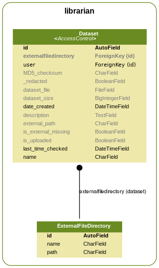

These class diagrams are generated from the model classes. You can run the following command to regenerate them.

    cd ~/git/Kive/kive
    ./manage.py graph_kive --setting kive.UML_settings

You will need django_extensions and pygraphviz installed, see the INSTALL.md file for more details.

### Models ###
#### archive ####

#### datachecking ####

#### fleet ####

#### librarian ####

#### metadata ####

#### method ####

#### pipeline ####

#### portal ####

#### sandbox ####

#### stopwatch ####

#### transformation ####

